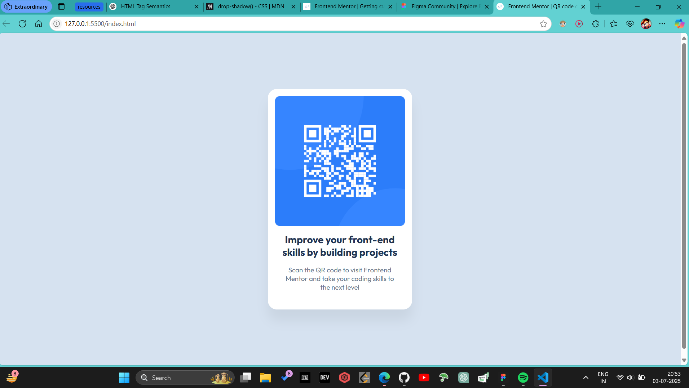
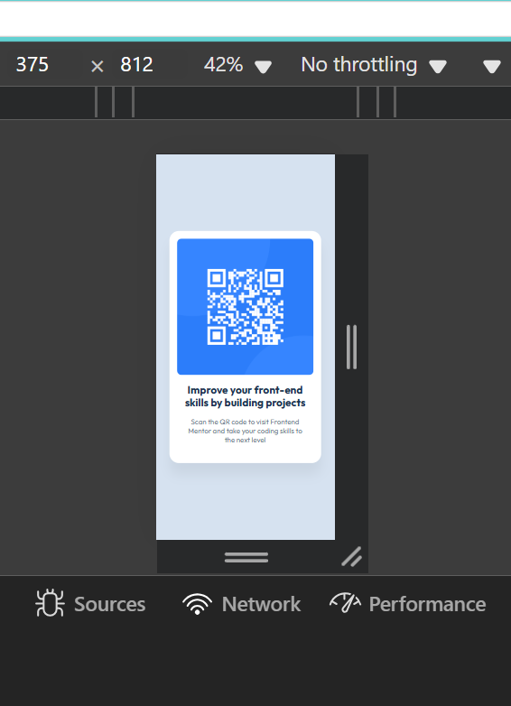

# Frontend Mentor - QR code component solution

This is my solution to the [QR code component challenge on Frontend Mentor](https://www.frontendmentor.io/challenges/qr-code-component-iux_sIO_H). It's a simple beginner-level challenge focused on building a clean and responsive UI using HTML and CSS.

## Table of contents

- [Overview](#overview)
  - [Screenshot](#screenshot)
  - [Links](#links)
- [My process](#my-process)
  - [Built with](#built-with)
  - [What I learned](#what-i-learned)
  - [Continued development](#continued-development)
  - [Useful resources](#useful-resources)
- [Author](#author)

---

## Overview

### Screenshot

### Links

- Solution URL: [Solution URL](https://github.com/MSAndromeda/qr-code-component)
- Live Site URL: [Live site URL](https://msandromeda.github.io/qr-code-component/)

---

## My process

### Built with

- Semantic HTML5
- CSS3 (Flexbox)
- Mobile-first responsive layout
- Google Fonts (Outfit)
- Box-shadow and border-radius for card styling

### What I learned

This was my first challenge from Frontend Mentor. Even though it's a simple one, it helped me practice writing semantic HTML and clean CSS. A few things I focused on:

- Creating a centered layout using Flexbox
- Matching the Figma design exactly
- Using `box-shadow` instead of `filter: drop-shadow()` for layout elements
- Understanding when to use things like `min-content` and `inline-block` to size elements based on content

### Continued development

In future projects, I want to:

- Improve my accessibility practices
- Practice writing even cleaner, more scalable CSS
- Get more comfortable using semantic tags like `<figure>`, `<section>`, etc. where appropriate
- Try writing the same layout in TailwindCSS or with utility classes

### Useful resources

- [MDN Web Docs - box-shadow](https://developer.mozilla.org/en-US/docs/Web/CSS/box-shadow)
- [CSS Tricks - Centering in CSS](https://css-tricks.com/centering-css-complete-guide/)
- [Frontend Mentor Community](https://www.frontendmentor.io/community)

---

## Author

- Frontend Mentor – [@ManasAnandSingh](https://www.frontendmentor.io/profile/MSAndromeda)
